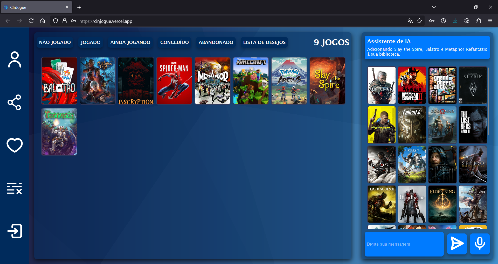

# CInJogue

<b>Deployed demo:</b> https://cinjogue.vercel.app/ (lento)

## Equipe
Desenvolvimento de Software - CIn/Ufpe - 2024.2 - **Equipe 10**
- André Vinícius Nascimento Cruz - **avnc**
- Gabriel Bezerra Moraes - **gbm2**
- Lavoisier Oliveira Cândido - **loc2**
- Lucas Moraes - **lmo2**
- Lucas Vinicius Moura da Silva - **lvms** (Enviado para a equipe 11)
- Luiz Eduardo de Andrade Lins - **leal** (Recebido da equipe 9)

## Projeto

Aplicação que permite ao usuário criar e gerenciar uma biblioteca pessoal de jogos com assistência do modelo de IA generativa Gemini.

<div align=center>
</img>
</div>

## Funcionalidades

### Gerenciamento da biblioteca interagindo com a IA que é capaz de 5 comandos:
| Commando | Descrição |
|---|---|
|Recomendar|Exibe jogos com base nas preferências do usuário, estes podem ser adicionados à biblioteca ou recusados pelo usuário.|
|Adicionar|Adiciona jogos à biblioteca do usuário.|
|Classificar|Define a classificação de items da biblioteca com uma pontuação entre 0 e 10.|
|Definir estado|Define o estado de um item da biblioteca como <b>Não jogado</b>, <b>Jogado</b>, <b>Ainda jogando</b>, <b>Concluído</b>, <b>Abandonado</b>, <b>Lista de desejos</b>|
|Remover|Remove item da biblioteca|

### Visualizar a biblioteca de outros usuários e compartilhamento de jogos entre bibliotecas
Clique no ícone de compartilhamento e insira o nome de um usuário na caixa de entrada indicada. Você sera capaz de visualizar os jogos na biblioteca deste. Items que você possui em comum com o outro usuário serão distinguidos com a cor verde. Clique em um item para adiciona-lo à sua prórpira biblioteca.

### Definição de preferências relacionadas à plataformas, gêneros, temas e faixas etárias com um sistema de tags cridas pelo usuário.
Clique no ícone de coração, 4 categorias de preferência serão exibidas. Insira suas preferências relevantes a cada categoria em suas respectivas caixas de entrada o que criará tags para cada uma. Você pode remover as tags clicando nos botões X em cada tag. As preferência serão enviadas ao modelo de IA toda vez que você mandar uma mensagem.

### Marcar jogos para que a IA não os recomende novamente
Clique em um jogo na aba de recomendações da IA e clique no botão não recomende, o título do jogo será adiconado à uma lista que será enviada ao modelo com a instrução explicíta de que aqueles jogos não devem ser recomendados novamente. Você pode visualizar os jogos nessa lista e removê-los dela clicando no ícone de linhas com um X.

### Obtenção de dados de jogos usando a API do [GiantBomb](https://www.giantbomb.com/api/).
Toda vez que a IA tenta adicionar um jogo, seja às recomendações ou à biblioteca, o programa checa se o jogo já foi registrado no banco de dados, caso não, o jogo é procurado através da API de buscas do GiantBomb. Todos os resultados de uma busca são registrados no banco de dados mas somente o primeiro é utilizado para o comando de adição em questão. 

### Interagindo com o modelo de IA

Digite seu comando na caixa de entrada no canto inferior direito da tela e envie clicando a tecla ENTER. Exemplos de comandos que você pode experimentar:

    Recomende jogos de ação
    Adicone Minecraft à minha biblioteca
    Coloque a nota de Minecraft como 10
    Adicione 3 jogos de sua escolha à minha biblioteca
    Defina o estado de todos os jogos como Lista de Desejos
    Remova todos os items da minha biblioteca

## Tecnologias Utilizadas

#### **Backend**

- **Python**: Linguagem de programação. Escolhida por já ser familiar aos integrantes do grupo e possuir uma ampla gama de bibliotecas para auxiliar a implemtação das funcionalidades do software.
- **Pytest**: Biblioteca de Python. Utilizada para criação de testes unitários automatizados
- **google.generativeai**: Biblioteca de python. Permite o uso do modelo generativo de linguagem Gemini através de código. Incluindo o envio e recebimento de mensagens, e configurações do formato que as respostas devem seguir.
- **Requests**: Biblioteca de Python. Utilizada para realizar requisições HTTP para a API da GiantBomb e adquirir dados sobre videogames.
- **Flask**: Biblioteca de Python. Usada para criar as rotas de API que permitem que o frontend interaja com o backend, enviando e recebendo informações.
- **SQLAlchemy**: Biblioteca de Python. Utilizada para criação do banco de dados SQLite que armazena todas as informações tanto de jogos quanto de usuários.
- **Speech Recognizer**: Biblioteca de Python. Utilizada para processar as mensagens de voz e enviar elas como texto para o modelo de IA.

#### Frontend 
- **HTML**: Linguagem de marcação. Essencial para definir os componentes que estarão presentes na página da aplicação. 
- **CSS**: Linguagem de marcação. Essencial para definir como os componentes devem ser exibidos por um navegador. 
- **Javascript**: Linguagem de programação. Essencial para criar aplicações interativas que podem ser executadas por um navegador.
- **Node.Js/NPM**: Utilizados para criação da aplicação web e instalação de bibliotecas de Javascript.
- **Vite**: Servidor de desenvolvimento local. Utilizado para execução da aplicação web localmente permitindo o desenvolvimento.
- **React**: Biblioteca de Javascript. Utilizada pois facilita a criação da interface gráfica da aplicação principalmente pelo uso de state hooks que podem ser usados para atualizar as informações exibidas na página em função de uma variável de forma automática.
- **Axios**: Biblioteca de Javascript. Utilizada para fazer requisições HTTP ao backend. Escolhida pois possui error handling e JSON parsing automáticos, ao contrário da função nativa de JS fetch().
- **Wav Encoder**: Biblioteca de Javascript. Utilizada para converter o áudio enviado como mensagem de voz para o formato WAV PCM, pois este é o formato reconhecido pela biblioteca Speech Recognizer no backend.

## Estrutura do Projeto

#### Backend (Servidor em Flask e database com SQLAlchemy e SQLite)

```
├── backend/
│   ├── flaskr/
│   │   ├── app.py
│   │   ├── database/
│   │   ├── gemini/
│   │   ├── giantbomb/
│   │   ├── routes/
│   ├── requirements.txt
```

#### Frontend (Aplicação web feita com React + Vite)

```
├── frontendJS/
│   ├── .gitignore
│   ├── eslint.config.js
│   ├── index.html
│   ├── node_modules/
│   ├── package.json
│   ├── package-lock.json
│   ├── public/
│   ├── src/
│   │   ├── Assets/
│   │   ├── App.jsx
│   │   ├── components/
│   │   ├── global.js
│   │   ├── main.jsx
│   │   ├── styles/
│   ├── vite.config.js
```

## Requisitos

- [Python 3.13](https://www.python.org/downloads/) ou mais recente
- [Node.js 20.17.0](https://nodejs.org/en/download) ou mais recente
- Chave de API do [Gemini AI](https://aistudio.google.com/app/apikey)
- Chave de API do [GiantBomb](https://www.giantbomb.com/api/)

**OBS:** Será necessário criar contas em cada uma das plataformas para conseguir uma chave de API.

## Setup

1. Clone o repositório e navegue para o diretório do projeto:

   ```sh
   git clone <URL_DO_REPOSITORIO>
   cd <NOME_DO_DIRETÓRIO>
   ```

2. Configure as variáveis de ambiente:

   Crie um arquivo .env baseado no .env.example

   ```sh
   copy .env.example .env
   ```

   Edite o arquivo .env com suas configurações.

3. Tendo configurado o arquivo .env, execute o arquivo setup.sh em um terminal bash para configurar e iniciar o backend e frontend
   ```
   chmod +x setup.sh
   ./setup.sh
   ```
   Alternativamente, siga os próximos passos para configurar e iniciar o projeto manualmente

### Backend

1. No diretório do projeto, navegue para o diretório do backend:

   ```sh
   cd backend
   ```

2. Crie e ative um ambiente virtual:

   ```sh
   python -m venv .venv
   .venv/Scripts/activate
   ```

3. Instale as dependências:

   ```sh
   pip install -r requirements.txt
   ```

4. Inicie o servidor Flask:
   ```sh
   python flaskr/app.py
   ```

### Frontend

1. No diretório do projeto, navegue para o diretório do frontend:

   ```sh
   cd frontendJS
   ```

2. Instale as dependências:

   ```sh
   npm install
   ```

3. Inicie o servidor de desenvolvimento:
   ```sh
   npm run dev
   ```
4. Acesse o frontend em [http://localhost:8000/](http://localhost:8000/)
